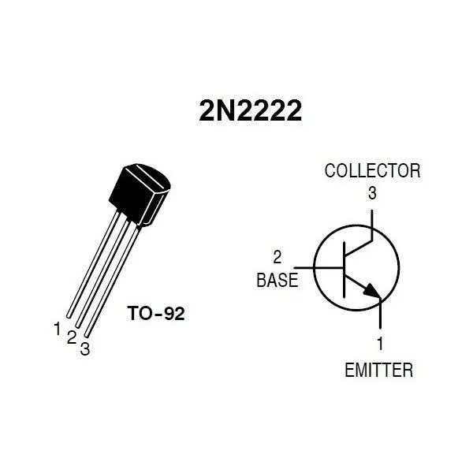
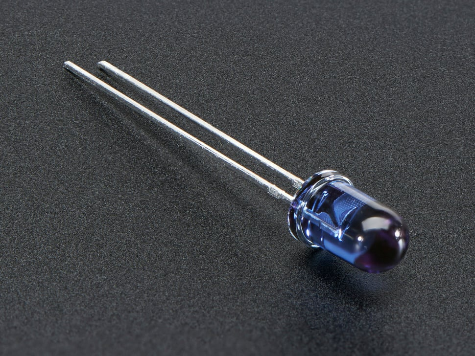
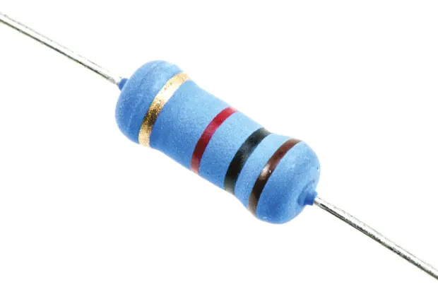
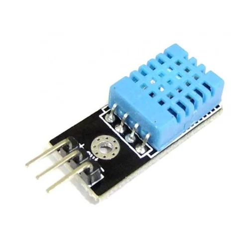
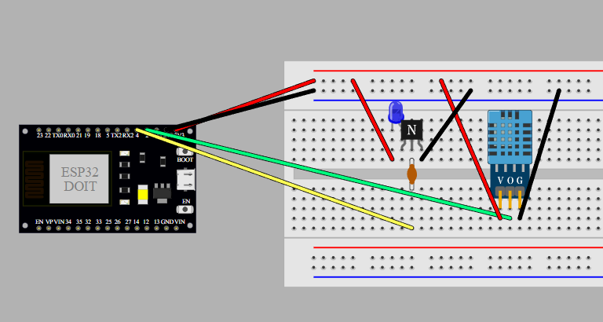
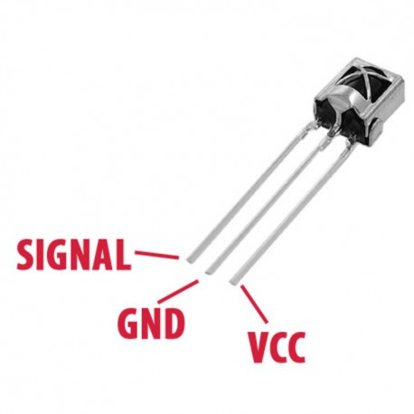
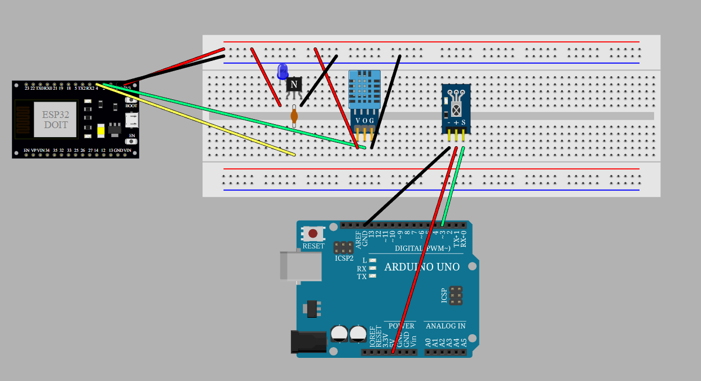

## **Abstract**

Implement an IoT infrared remote controller that can remotely control air conditioners and electric fans, while also recording the temperature and humidity.

## **Implementation**

1. **Air Conditioner:**
    1. Use an **ESP32** to convert various remote infrared signals with a **2N2222** transistor and send them out via an **IR LED**. The infrared signals use a library that matches the communication protocol of the air conditioner brand. Use a **DHT11** module to record the current environmental temperature and humidity. The IoT platform used is **Blynk**.
        - ESP32 communication protocol library:
          
            [GitHub - crankyoldgit/IRremoteESP8266: Infrared remote library for ESP8266/ESP32: send and receive infrared signals with multiple protocols. Based on: https://github.com/shirriff/Arduino-IRremote/](https://github.com/crankyoldgit/IRremoteESP8266/tree/master)
            
    2. Physical Components:
        - *Components Used*:
        1. **2N2222 * 1**
           
           
        2. **IR LED * 1**
            
           
        3. **Resistor * 1**
            
           
        4. **DHT11 * 1**
            
           
        - *Circuit Diagram*:
          
          
        
    3. Blynk:
        
2. **Electric Fan:**
    1. First, use an **Arduino UNO** with a **vs1838B** module to receive the raw infrared signal, record the raw signal, then use an **ESP32** to convert various remote infrared signals with a **2N2222** transistor and send them out via an **IR LED**. Use a **DHT11** module to record the current environmental temperature and humidity. The IoT platform used is **Blynk**.
        - Library for Arduino to receive **IR raw data**:
            
            [GitHub - cyborg5/IRLib2: Library for receiving, decoding, and sending infrared signals using Arduino](https://github.com/cyborg5/IRLib2/tree/master)
            
        - Library for ESP32 to send **IR raw data**:
            
            [GitHub - crankyoldgit/IRremoteESP8266: Infrared remote library for ESP8266/ESP32: send and receive infrared signals with multiple protocols. Based on: https://github.com/shirriff/Arduino-IRremote/](https://github.com/crankyoldgit/IRremoteESP8266/tree/master)
            
    2. Physical Components:
        - *Components Used*:
        1. **vs1838B * 1**
  
           
        2. **2N2222 * 1**
            
           
        3. **IR LED * 1**

           
        5. **Resistor * 1**
           
           
        6. **DHT11 * 1**
            
           
        - *Circuit Diagram*:
          
          
    3. Blynk:
        
    4. Example of Raw Infrared Signal:
    - Electric Fan Power Switch:
    
    ```arduino
    #define FAN_SWITCH_RAW_DATA_LEN 68
    uint16_t FAN_SWITCH_rawData[RAW_DATA_LEN] = {
    	9030, 4466, 594, 558, 574, 558, 578, 558,
    	574, 558, 578, 1662, 578, 1662, 578, 558,
    	574, 558, 574, 1666, 578, 1662, 578, 1666,
    	574, 1666, 574, 558, 578, 554, 578, 1662,
    	578, 1662, 582, 554, 578, 554, 578, 558,
    	578, 1662, 578, 554, 578, 554, 578, 558,
    	578, 1662, 578, 1662, 578, 1662, 578, 1662,
    	582, 554, 602, 1638, 578, 1662, 578, 1662,
    	578, 554, 582, 1000
    };
    ```
    

## **Issues and Solutions**

- In the implementation for the fan, the method of copying and storing the original infrared signal for transmission was not applicable to air conditioners. This might be due to air conditioners having a stricter communication protocol compared to fans. Fortunately, a library containing various brand communication protocols was eventually found.
- Next to 5V is CMD, not GND!!!

## **Final Outcome**

Due to Blynk's data stream limitations, the project was divided into two separate boards, and not all controller functions could be covered. However, all essential functions were implemented, as shown in detail in the videos.

- **ESP32 Fan IR remote control**

https://youtu.be/68HZ8h9fc4A
